# HiPerClust

This repository provides a complete, modular pipeline for an automated Hierarchical Density-Based Spatial Clustering of Applications with Noise (HDBSCAN) on Atom Probe Tomography (APT) data.
The pipeline includes synthetic APT dataset generation, data preprocessing, machine learning model training for ConvNeXt-Tiny and ResNet-50, HDSCAN clustering, and results postprocessing. 
Designed for both microscopy analysis workflows and research, it enables reproducible cluster analysis on APT datasets.

<p align="center">
    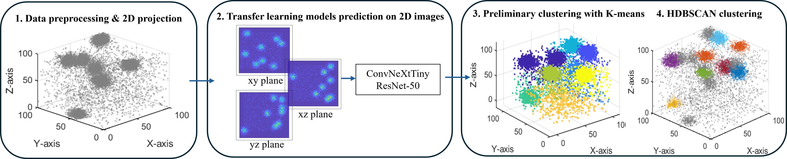
    <br>
    <em> Figure 1: Flowchart of the proposed framework. </em>
</p>


## 1. Overview

Atom Probe Tomography (APT) provides subnanometer scale resolution at sensitivies greater than tens of parts per million.  Output from atom probe tomography includes a 3-D point cloud where each point is a spectrum identifying the atom or atoms at that point.  Reproducibly identifying and localizing clusters of similar atoms in APT output has been historically difficult.  The state-of-the-art solution, HDSCAN, requires several parameters as inputs that have significant impact on the quality of the resulting predicted clusters.  The machine learning model provided here eliminates the need for the instrument scientist or researchers to identify the proper inputs for HDBSCAN a priori to produce an optimal cluster.  This machine learning model code, HiPerClust, takes as input the position file from APT and provides the input parameters for HDBSCAN that produce an optimal clustering.  HiPerClust relies upon well-established computer vision models, including ResNet and ConvNeXt.  HiPerClust supports both ResNet and ConvNeXt though the ConvNeXt version provides slightly better results for clustering than the ResNet implementation.

<p align="center">
    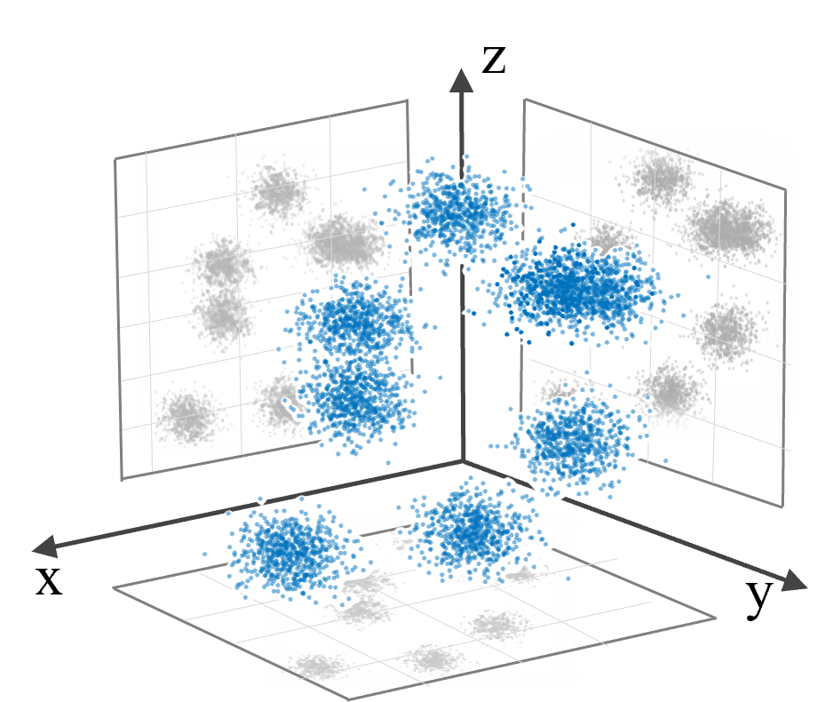
    <br>
    <em> Figure 2: Three-dimensional point cloud representation of atom probe tomography (APT) data, alongside its 2D projections onto the xy, xz, and yz planes. The projected density shadows quantitatively illustrate the spatial distribution and potential number of atomic clusters present in the dataset. </em>
</p>

This repository includes following six directories; codes are provided in both Python and Matlab. 

Step 1: Synthetic APT Data Generation.  This directory creates the training data to train HiPerClust.  If you don't wish to retrain the model, you can skip this directory.  This directory creates controlled datasets with known characteristics for training and benchmarking models.

Step 2: Data Preprocessing.  This directory takes in the position file from APT and projects the 3D point cloud data onto 2D planes (xy,xz,yz).  These 2D planes are then normalized and formatted into jpeg images.  The default pixel size for the jpeg images is 100x100 pixels but this can be adjusted as needed.

Step 3: Model Training.  This directory uses the synthetic trained data from step 1 to train the models in which HiPerClust is implemented.  Those models are ConvNeXt-Tiny and ResNet-50.  All training data must go through the preprocessing in step 2.  If you don't wish to retrain the model, you can skip this directory.
   
Step 4: Inference.  This directory can be used to infer HDBSCAN input parameters directly from data that has been preprocessed in Step 2.  

Step 5: HDBSCAN.  This directory takes the output from step 4 and computes an optimal clustering
based on HDBSCAN.

Step 6: Postprocessing.  This directory contains code which summarizes, visualizes, and exports the final results for reporting.


## 1. Getting started

Equivalent codes in Matlab and Python are provided preprocessing and post-processing. The machine learning models are only provided in Python. 

Tested with:  
Python Version 3.9.23   
Tensorflow 2.16.1  

Additonal software:    
MATLAB if you choose MATLAB version.


## 2. Quick Start Example (Python version)

### Step 1: Synthetic APT Data Generation.

- Go to the subfolder "Step1_Synthetic_APT_Data_Generation"  
- Run the script "Step1_generateclusters.py"  
- Example user input

<div style="font-size: 60%; line-height: 1.2;">

| **Parameter**           | **Description**                             |**Example**                                 |
|-------------------------|---------------------------------------------|---------------------------------------------|
| Dim                     | Simulation volume [X, Y, Z] in nm           | [80, 80, 80]                                |
| TotalNumPoints          | Total number of atoms (Fe + Cr)             | 7,000,000                                   |
| CrPercentage            | Fraction of Cr atoms                        | 0.12 (12%)                                  |
| Density                 | Cluster density (number of clusters/m³)        | 9.5e23                                      |
| NumClusters             | Number of Cr-rich clusters                  | 100                                         |
| ClusterSizeInfo         | NumClusters, Cluster radius (nm) and fluctuation (nm) in X direction, Cluster radius (nm) and fluctuation (nm) in Y direction, Cluster radius (nm) and fluctuation (nm) in Z direction               | [NumClusters, 1.5, 0.2, 1.5, 0.2, 1.5, 0.1]  |
| MinClusterSeparation    | Minimum distance between clusters (nm)      | 5                                           |
| OutputFolder            | Folder to save datasets                     | './SyntheticData'                           |

</div>

- Output  
The output of this step is a synthetic APT dataset as a Nx3 matrix. A visualization of the output with the above example user input:  
<p align="center">
    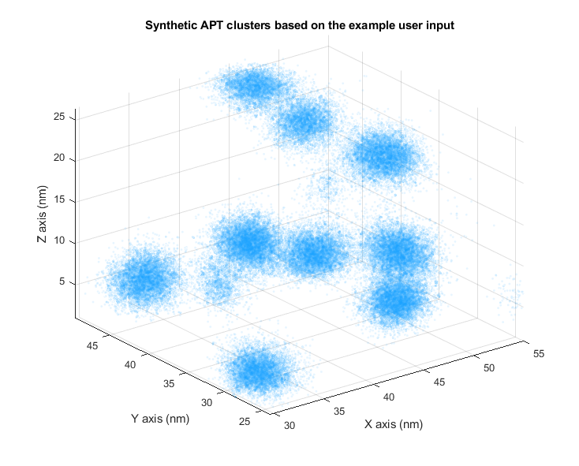
    <br>
    <em> Figure 3: A subvolume of the synthetic APT dataset. </em>
</p>


### Step 2: Data Preprocessing.

- Go to the subfolder "Step2_Data_preprocessing"  
- Run the script "Step2_feature extraction_synthetic2D_Train.py"  
- Example user input

<div style="font-size: 60%; line-height: 1.2;">

| Parameter           | Description                                         | Typical Value           |
|---------------------|-----------------------------------------------------|--------------------------|
| basePath            | Folder containing synthetic 3D datasets             | ./synthetic_data/     |
| numSyntheticFiles   | Number of synthetic files to process                | 1                   |
| cubeSize            | Size of each subvolume in nanometers                | 20|
| gridsize            | Grid size for projection image (before resizing)    | 100                   |
| saveFolder          | Output folder for images                            | Train                 |
| minPointsThreshold  | Minimum number of points in a cube                  | 300                   |
| minClusterSize      | Minimum cluster size for ground truth labeling      | 100                   |
| imageSize           | Final image size in pixels (for CNN input)          | [100, 100]            |

</div>

- Output  
Using the synthetic APT dataset generated in 'Step 1: Synthetic APT Data Generation', this step generates .jpg images, which serve as the input for 'Step 3: Model Training'. If you want to test your dataset, you must also run this step to preprocess the testing data into .jpg format before feeding it into the model. Below are some example images:  

<p align="center">
   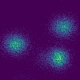
   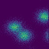
   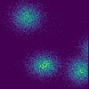
   <br>
   <em> Figure 4: JPEG images generated by projecting the subvolume onto the xy, xz, and yz planes. </em>
</p>


### Step 3: Model Training.

- Go to the subfolder "Step3_Model_training"  
- Run the script "ConvTiny.ipynb" or "ResNet50.ipynb"  

<p align="center">
   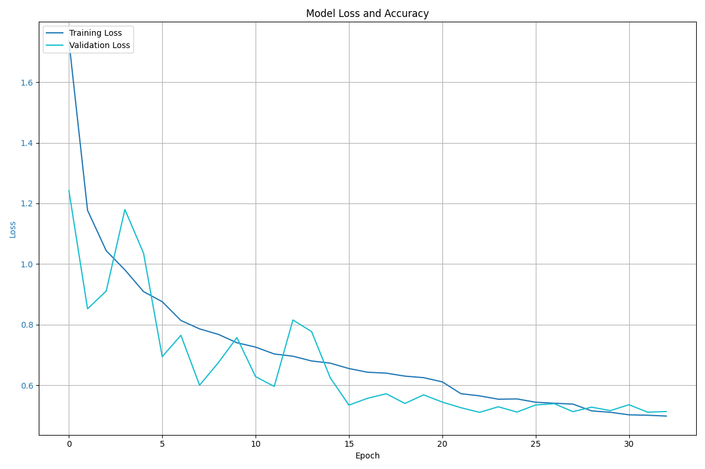
   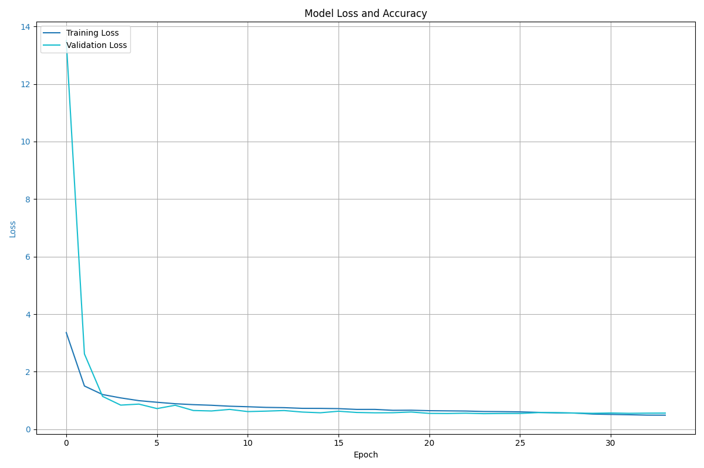
   
   <br>
   <em> Figure 5: Training history of the ConvNeXt-Tiny and ResNet-50. </em>
</p>

### Step 4: Inference.

Once the model has been trained, users can directly apply it to their own testing data for evaluation  
- Go to the subfolder "Step4_Inference"  
- Run the following Python example code in the README  


```
import os
from PIL import Image
import numpy as np
import tensorflow as tf
from tensorflow.keras.models import load_model
from tensorflow.keras.saving import register_keras_serializable

# Path to the folder containing .jpg images
image_folder = '/home/tangy/pytorch/'
image_files = sorted([f for f in os.listdir(image_folder) if f.endswith('.jpg')])

# Load all images into a numpy array
X = np.array([
    np.array(Image.open(os.path.join(image_folder, fname)).resize((100, 100)))
    for fname in image_files
])
X = X / 255.0  # if your model expects normalized input

# Load the model and specify the custom objects
loaded_model = load_model('Convtiny.keras') 
# OR
loaded_model = load_model('ResNet50.keras')

# Predict
predictions = loaded_model.predict(X)
print(predictions)
```
- Output  

<p align="center">
   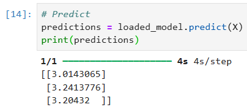
   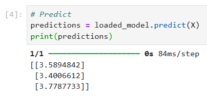
   <br>
   <em> Figure 6: Prediction of three images from the 'Step 2: Data Preprocessing', using the trained ConvNeXt-Tiny model (left) and ResNet-50 model (right). </em>
</p>

### Step 5: HDBSCAN.

In this step, the model's prediction results are used as input for clustering.

- Run the script "step5_clustering.py"      
- Example user input    

| **Variable Name**     | **Value**                     | **Description**                                                  |
|-----------------------|-------------------------------|------------------------------------------------------------------|
| rawDataFile         | "subvoume.txt"                  | Raw 3D coordinates; expects a variable with Nx3 coords    |
| predictionFile      | "predictions.mat"      | Model predictions (.mat); can be a vector or scalar              |
| tempDataFile        | "TempHDBSCANfile.txt"       | Temporary file for intermediate data                             |
| tempParamFile       | "TempHDBSCANparameters.txt" | Temporary file for clustering parameters                         |


- Output    
```
  Preliminary clustering complete. Found 3 clusters.  
  HDBSCAN parameters: min_cluster_size = 1048, min_samples = 105 
```   
<p align="center">
  
</p>


The function processHDBSCANResults(dataFile) returns a structure array named clusters. Each element in this array represents a single detected cluster (excluding noise).
Each clusters contains the following fields:  

| **Field Name**   | **Description**                                                                 |
|------------------|---------------------------------------------------------------------------------|
| labels         | Cluster ID (integer, starting from 0).                                          |
| probabilities  | Membership probability for each point in this cluster (vector).                 |
| persistence    | Persistence score of the cluster (higher = more stable cluster).                |
| atomPositions  | Nx3 matrix of coordinates for all points in this cluster.                       |
| clustersize    | Number of points in this cluster (integer).                                     |

### Step 6: Postprocessing.

The hdbscanCluster obtained in Step 5 can be further post-processed to derive the following results:  
```  
  Number Density: 6.9767e+25 clusters/m^3  
  Average Cluster Radius: 3.013 nm  
  Volume Fraction: 0.1196  
```
<!--
<p align="center">
    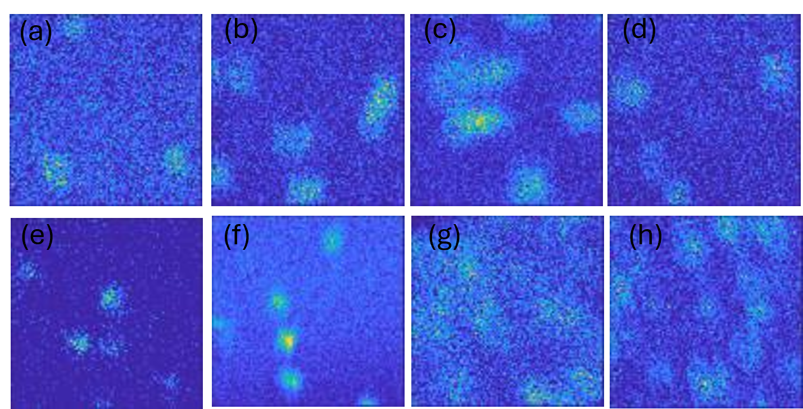
    <br>
    <em> Figure 3: (a)-(d) Training dataset generated from synthetic APT data. Each image represents a two-dimensional projection of the atomic density distribution within selected 3D subvolumes; (e)-(h) Testing dataset derived from experimental APT measurements of Fe–Cr alloys containing 9–18 at.% Cr. </em>
</p>
-->

### Visualization

Using the proposed workflow, we tested an experimental Fe-Cr APT dataset. A 3 nm-thick slice was extracted from the dataset and processed through the workflow. The clustering analysis identified approximately 220 clusters within the slice. The image below visualizes the detected clusters, with different colors representing individual clusters.

<p align="center">
    
    <br>
    <em> Figure 8: This 3D visualization is for an Iron (Fe)-Chromium (Cr) alloy post-irradiation, a vital material for nuclear energy applications. The Fe-Cr alloy, irradiated to 1.8 displacements per atom (dpa) at 290 degrees Celsius at Idaho National Laboratory’s Advanced Test Reactor, reveals Cr atoms clustering due to irradiation effects, a phenomenon that significantly influences the alloy's physical and mechanical properties. Captured through Atom Probe Tomography (APT), this snapshot zooms into a 3-nanometer-thick slice from a sample measuring roughly 80 × 80 × 200 nanometers. The slice encompasses approximately 54,000 Cr atoms.  The image uses Cr atoms represented as vibrant spheres, each hue indicating the specific cluster to which the Cr atom belongs.  This 3D visualization is rendered from Blender.
  </em>
</p>


## 3. License
This project is licensed under the MIT License.

Copyright 2025, Battelle Energy Alliance, LLC 

## 4. Authors

- **Yalei Tang**  
  Contact: [yalei.tang@inl.gov](mailto:yalei.tang@inl.gov)

- **Mukesh Bachhav**  
  Contact: [mukesh.bachhav@inl.gov](mailto:vmukesh.bachhav@inl.gov)

- **Matthew W. Anderson**  
  Contact: [matthew.anderson2@inl.gov](mailto:matthew.anderson2@inl.gov)

Special thanks to Jeremy Sharapov who assisted in testing the repository.
